# Navi MuJoCo SDK Translator

Current release: **v1.0.0**  
The authoritative release status is recorded by the bundled release validation
and final release report; a package is not release-ready unless every gate passes.

This project parses a restricted subset of Navi SDK-style Python into a
validated intermediate representation, schedules it, and executes supported
behavior in MuJoCo. It is an independent simulator and translator, not the
vendor SDK or a claim of exact hardware equivalence.

> **117/117 structured method coverage does not mean that all 117 methods are
> fully equivalent to the real robot.** The capability matrix separates backend
> behavior, SDK contract completeness, Ground Truth quality, and evidence.

## Current verified scope

- 117/117 canonical methods have structured handling.
- 80/80 physical-behavior claims have evidence.
- 79 methods are compatibility-level `APPROXIMATE`; the label includes both
  strong physical approximations and conservative behaviors with explicit
  limitations.
- No generic success fallback, silent success, or direct action-time
  `qpos`/`qvel` injection is allowed.
- Hardware-only, model-blocked, unresolved, and unavailable operations return
  structured outcomes instead of fabricated success.

The complete user-facing matrix is in
[`docs/sdk_capabilities.md`](docs/sdk_capabilities.md) and
[`docs/sdk_capabilities.csv`](docs/sdk_capabilities.csv).

## Architecture

```mermaid
flowchart LR
    A["Restricted SDK Python"] --> B["AST Security Scanner"]
    B --> C["SDK Parser + Registry"]
    C --> D["Validator + IR"]
    D --> E["Scheduler"]
    E --> F["MuJoCo Backend"]
    F --> G["Controller Adapter"]
    G --> H["MuJoCo Physics"]
    H --> I["State/Safety/Trace"]
    I --> J["Versioned Result + Video"]
```



See [`docs/architecture.md`](docs/architecture.md) for component boundaries.

## Install

Python 3.10 or newer is required.

```bash
python -m venv .venv
```

Windows PowerShell:

```powershell
.venv\Scripts\Activate.ps1
python -m pip install -e ".[dev,video]"
```

Linux or WSL2:

```bash
source .venv/bin/activate
python -m pip install -e ".[dev,video]"
```

For a non-editable local installation:

```bash
python -m pip install .
```

## Minimal simulation

```bash
navi-sim examples/movement/turn_then_forward.py \
  --allow-unresolved \
  --headless \
  --seed 0 \
  --output results/example \
  --pretty
```

Windows PowerShell can use the same command on one line:

```powershell
navi-sim examples\movement\turn_then_forward.py --allow-unresolved --headless --seed 0 --output results\example --pretty
```

The default output is `./results/<unique-run-id>/`. A non-empty explicit output
directory is rejected unless `--overwrite` is supplied.

## Headless, viewer, and video

```bash
navi-sim examples/basic/stand.py --allow-unresolved --headless
navi-sim examples/basic/stand.py --allow-unresolved --viewer
navi-sim examples/actions/wave_hand.py --allow-unresolved --headless --record-video
```

Video recording is optional and requires `pip install ".[video]"`. The viewer
requires a working OpenGL/display environment. Headless Linux may also need an
appropriate MuJoCo GL backend configuration.

## Full SDK acceptance

```bash
navi-sdk-acceptance \
  --all \
  --allow-unresolved \
  --continue-on-failure \
  --headless \
  --no-video \
  --output results/full_sdk_release
```

The acceptance output includes one versioned `result.json` per method and a
117-row `sdk_method_matrix.csv`.

## Result contract

Every new result contains:

- schema and tool version;
- run ID, seed, timestamp, input/config/model SHA-256;
- four-axis capability status;
- execution and safety sections;
- limitations and artifact references.

Schemas are in [`schemas/`](schemas/). Existing historical audit results are
preserved as immutable evidence and are not retroactively rewritten.

## Capability statuses

- `backend_behavior_status`: what the MuJoCo backend can physically or
  structurally do.
- `sdk_contract_status`: whether vendor return/blocking/async semantics are
  known.
- `ground_truth_status`: strength of video/semantic evidence.
- `evidence_status`: verification quality and remaining limitations.

The old `status` field is deprecated compatibility metadata derived from these
four dimensions; it is not a second source of truth.

## Test and validation

Fast installed-package check:

```bash
navi-sim-smoke-test --output results/smoke
```

Complete release gate:

```bash
python tools/run_release_validation.py
```

The complete gate runs Translation Core, MuJoCo Backend, Full SDK, Correction,
Audit, quick checks, model validation, the fresh 67-test physics regression,
117-method CLI acceptance, schema checks, clean installation, smoke tests,
path portability, and deterministic replay.

## Windows, Linux, and WSL2

- Runtime resources resolve with `pathlib.Path` relative to the installed
  modules.
- No production code depends on a drive letter, user directory, Codex output
  path, or hard-coded ffmpeg executable.
- Default result output is relative to the caller's current working directory,
  not the installed package directory.
- Use `--config-dir` only with a complete compatible configuration tree.

See [`docs/path_portability.md`](docs/path_portability.md).

## Security and trust boundary

Input files are parsed as AST and are not executed with `exec`, `eval`, or
Python import machinery. Only supported syntax and SDK calls are translated.
This is a restricted translator, not a general-purpose Python sandbox.

See [`docs/security_model.md`](docs/security_model.md).

## Known limitations

The release does not claim:

- complete official return, blocking, or async contracts;
- exact vendor joint/IMU/contact trajectories;
- missing head, camera, perception, mapping, or autonomous planning behavior;
- a water environment;
- real battery or hardware state;
- safe implementation of all high-dynamic actions.

Details and affected methods are in
[`docs/known_limitations.md`](docs/known_limitations.md). The information needed
from the vendor is listed in
[`docs/vendor_information_request.md`](docs/vendor_information_request.md).

## Project layout

- `translator/`: parser, validator, IR, scheduler, schemas, provenance.
- `backends/`: capability registry and MuJoCo backend.
- `simulation/`: controller adapter, actions, state, safety, trace, results.
- `config/`: SDK specification, capability registry, Ground Truth, profiles.
- `examples/`: reproducible public SDK examples, including structured limits.
- `tests/`: Translation, MuJoCo, Full SDK, audit, correction, and release tests.
- `docs/`: user, architecture, capability, limitation, security, and vendor docs.
- `tools/`: release, smoke, audit, and reproducibility tooling.

## Correct interpretation

This release demonstrates reproducible simulator behavior and explicit
limitations. It must not be used as evidence that all 117 methods are exact
hardware replacements, that all videos are exact pose matches, or that the
official vendor SDK contract has been reconstructed.
