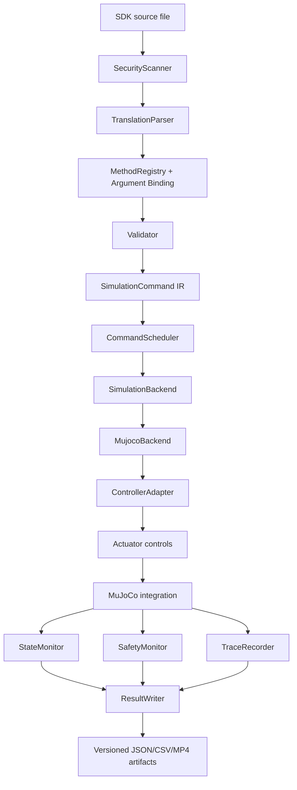

# Architecture

## Components

- **SDK Parser** reads a supported Python AST without executing user code.
- **Registry** resolves canonical methods and documented aliases.
- **Validator** checks method, argument, unit/range, and static constraints.
- **IR** preserves source location, canonical parameters, defaults, and
  unresolved contract metadata.
- **Scheduler** advances deterministic simulation time and records conservative
  assumptions for unresolved blocking semantics.
- **SimulationBackend** defines the backend contract.
- **MujocoBackend** dispatches structured commands or structured capability
  rejections.
- **ControllerAdapter** converts IR semantics to controller calls.
- **Action Registry / Profiles** provide fixed data-driven action phases.
- **State Monitor** samples MuJoCo position, orientation, velocities, joints,
  actuators, IMU, and contacts.
- **Safety Monitor** records warning/fatal events and terminates safely.
- **Trace Recorder** records state without injecting it.
- **Video Recorder** renders the same simulated state; camera differences are
  not used to claim action uniqueness.
- **Result Writer** emits versioned schema-validated artifacts and provenance.

## Invariants

### Turn convention

The SDK is positive-right/negative-left. MuJoCo/controller yaw uses the opposite
sign. Conversion occurs exactly once at the backend adapter boundary. Parser and
IR values remain in SDK convention.

### Body-frame movement

Forward, backward, lateral, and diagonal commands are defined in the current
robot body frame. After a turn, forward follows the new heading.

### WAIT

`time.sleep()` in supported input advances scheduled simulation time. The
translator never calls wall-clock `time.sleep` for the simulated wait.

### No state injection

Actions and locomotion write actuator controls only. They do not directly write
root `qpos`, root `qvel`, mocap state, or root forces. Resetting to the named
standing keyframe before a run is the only initial-state reset.

### Capability separation

Physical backend behavior, SDK contract completeness, Ground Truth strength,
and evidence quality are independent dimensions. The deprecated compatibility
status is mechanically derived from them.

## Extension points

- Add confirmed SDK metadata in `config/sdk_spec.json`.
- Add vendor-backed action phases in
  `config/action_profiles/full_sdk_profiles.json`.
- Extend model-supported dispatch in `backends/mujoco_backend.py`.
- Add sensors through `simulation/state_monitor.py` and
  `simulation/query_provider.py`.
- Update schemas only with explicit versioning and compatibility tests.

Do not add a trajectory solely to make a method unique; require SDK, vendor
telemetry, reliable Ground Truth, or a documented model capability.
